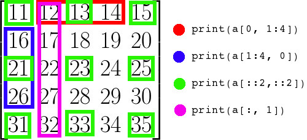

# Python 入门

<!-- keywords:key1;key2; -->
<!-- description:this is a description -->
<!-- coverimage: -->

## 为什么我们要学 Python

如果你问了我这个问题，我真不好回答。数学建模啥的，不一定要用 Python，但是是需要使用计算机编程。因为有很多数学问题，已经不是你手能够算出来的了，现在考试都能带计算器了，何况那些问题里实际问题的规模还差的很远。所要求解你的模型，必须要编程。

很多语言都可以编程，C，C++还有我最喜欢的 C#。为啥不用他们做数学建模？这个实际就是一个社区的问题，做舒徐建模的人都用 Fortran，R，Python，matlab 所以这些语言就会有很多人已经开发好的做数学建模的很多工具，你用起来就可以少写很多代码，直接用别人写过的就可以了。而且遇到建模相关问题，这些语言相关的资料也会多很多。

那为什么要用 Python 呢？因为流行呀，热门呀。这个回答非常对，就是这个原因。但是我门作为科学家我门要问一下，为什么？因为最近机器学习很热门，而有很多机器学习的包，应该说最好用的一些机器学习的包是为 Python 开发的。最最关键的是 Google 的 Alpha Go，那个下围棋的。他带动了深度学习的大流行，同时他的开发框架 TensorFlow 也就大流行了，tensorflow 就是 pythong 的一个包。

其实学啥都一样，别纠结。

## 配置一套 Python 开发环境

## Jupyter Notebook

用 VSCODE 开发 python 有一个好处就是可以实现和 Jupyter Notebook 一样的功能，同时也可以获得 VSCODE 全部的高高级功能。你只要新建一个.py 文件然后 python extension 就会自动的识别出来。

这个时候你可以输入 python 代码，就像一个普通的 python 代码文件一样，也可以输入：

```python
# %%
```

来打开一个新的 cell，在一个 cell 里面的代码可以独立的运行。第一次运行一个 cell 的时候会买一点，因为他要启动一个 ipython kernel。后面执行的 cell 都是在这个 kernel 里面运行的。python 是一个解释型的语言。每次执行一个 cell 可以认为就是在之前打开的一个 python terminal 里面输入代码执行。所以之前定义的变量后面的 cell 单独运行的时候也是存在的。

使用 cell 还有个好处就是可以使用 markdown，你只要输入：

```python
# %% [markdown]
```

这个 cell 里面的注释就会被当作 markdown 来解释。
ok 从现在开始我切换到 notebook 中来讲剩下的内容。

## Python 基础

这里你将学到：

1. 基本的数值操作
2. 变量和赋值
3. 流程控制
4. 定义函数
5. 基本数据结构
6. NumPy

### 练习 1

1. 写一个函数，一个球自由落体，输入时间 t 和时间间隔 dt，计算 t 每间隔 dt 时间的位移。
2. 写代码生成下面这个些数据，同样颜色的为一个 nparray，注意维度和方向：
   
3. 求下面这个积分：  
   $\int_0^1\int_0^1\int_0^1(x^y-z)dxdydz$

## Python 基础 2

这里你将学到：

1.  calculate derivative 计算微分
2.  calculate gradient 计算梯度
3.  integrations 积分
4.  solving linear equations 解线性方程
5.  soling non-linear equations 解非线性方程

### 练习 2

1. 在一个 3 维空间内，物质的密度分布为$\rho=x^2y^2z^2$,求一个圆锥体，底面为 xy 平面，圆心在远点，半径为 1，高位 1 的圆锥体的质量

## References

1. https://physics.nyu.edu/pine/pymanual/html/genindex.html
2. https://www.math.ubc.ca/~pwalls/math-python/
3. https://scipy-lectures.org/intro/numpy/exercises.html#array-manipulations
4. https://www.scipy.org/about.html
5. https://www.kdnuggets.com/2016/06/intro-scientific-python-numpy.html
6. https://www.southampton.ac.uk/~fangohr/teaching/python/book/html/16-scipy.html
