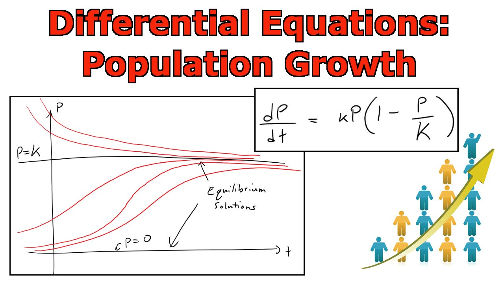
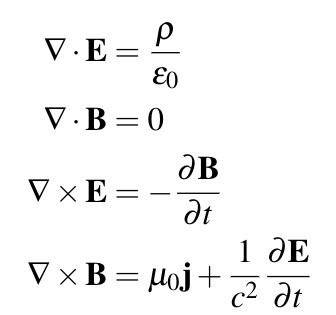
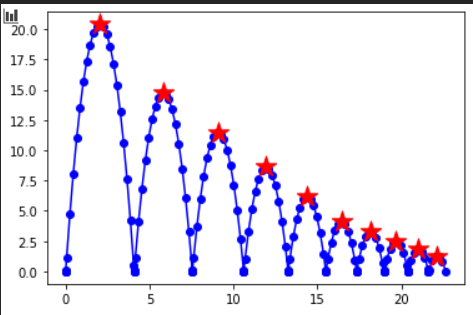

# 微分方程建模
1. 为什么要学习微分方程
1. 什么是微分方程
3. 微分方程建模的流程
2. Python求解ODE

## 为什么要学习微分方程

因为整个宇宙中的一切基本都可以用微分方程来建模。

从人口变换模型到流体力学到电磁场都可以用微分方程来建模。最有名的微分方程就是传说中的Maxwell方程组。

最最实用的微分方程，就是牛顿力学类里面的方正，就是我们最早学的$F=ma$也是微分分方程，因为$F=ma=m\frac{d^2x}{dt^2}$。

为什么微分方程这么神奇呢？因为我们面对的模型大部分是变化的，而不是静止的，描述一个变化的系统，当然是需要描述他的变化的规律，而微分就是描述一个变量变化的。隔壁学什么有限元，实际上就是求解复杂偏微分微分方程建模的问题的。

## 什么是微分方程

大家都学过微积分都学过微分方程，指导微分方程一般可以写成$\frac{dy}{dt}=f(y)$，求$y=g(t)$。但是，微积分大多是教大家怎么求解微分方程的，是一个纯数学问题。而实际上在建模中微分方程都是有物理意义的。

例如$F=ma=m\frac{d^2x}{dt^2}$，它描述的就是位移的二节倒数*质量就是受力。位移的倒数是速度，而速度的倒数就是加速度，我们经常关心的是在一个力作用下，一个物体的运动轨迹，比如发射火箭。要知道先这种简单微分方程，是由解析解的，比如如果F=常数，$x=\frac{1}{2}F/M*t^2$。但是如果F是t的函数呢？实际上很多微分方程式非常复杂的，我们根本不可能解析的求解，只能用数值的方法，还好我们有电脑，写代码解释非常简单的。

我们今天主要讲ODE，ordinary differential equation，也就是常微分方程，就是是指对一个自变量求导的。PDE，也就是骈文分方程partial differential equation是对多个自变量求导的，有偏微分的。挺麻烦的，我们先不讲。

## 微分方程建模的流程

流程很简单，我门首先要根据我们的对系统的理解，建立微分方程，这个主要是找到我们要求的函数，比如求位移x，然后找到我们要求的这个函数的微分和其他函数的关系，有些函数可能是已知的，比如受力。刚刚说的x的微分是速度，速度微分是加速度，加速度和力这个已知函数是有关系的。

我们下面举一个例子，这个例子很有名，叫做pursuit curve，就是追踪曲线，比如猫追老鼠，导弹追飞机，但你追小姐姐就不是，那是另一个方程：

>设位于坐标原点的甲舰向位于x轴上点A（1,0）处的乙舰发射导弹，导弹头始终对准乙舰。如果乙舰以最大速度1沿平行于y轴的直线行驶，导弹的速度为5，求导弹的运行的曲线方程，以及乙舰行驶多远时，导弹将击中它？

首先按照套路，找到要求的量，是导弹的运行曲线，也就是导弹的位置随时间变化的曲线，我们叫他M(t),M是，xy平面的坐标，$M(t)=(x(t),y(t,))$。他的倒数就是导弹的速度，那导弹的速度和已知量怎么有什么关系，有两个关系，一个是导弹始终照着甲舰，一个是导弹的速度为5。我们可以算出一个单位向量，表示这个导弹的速度方向，再*5就得到了速度了。
这个单位向量就是船的坐标减去导弹的坐标，然后除以自己的模，船的坐标我们写作$S(t)=(x_s(t),y_s(t,))$，后面为了简单我就不写t了：
$$
V_{direction}=\frac{(S-M)}{|(S-M)|}=(\frac{(x_s-x)}{\sqrt{(x_s-x)^2+(y_s-y)^2}},
\frac{(y_s-y)}{\sqrt{(x_s-x)^2+(y_s-y)^2}})
$$

然后我们只要把5乘上上面的速度方向就得到了速度就是我们的微分方程：
$$
\begin{cases}
x'=\frac{5(x_s-x)}{\sqrt{(x_s-x)^2+(y_s-y)^2}}\\

y'=\frac{5(y_s-y)}{\sqrt{(x_s-x)^2+(y_s-y)^2}}   
\end{cases}
$$

注意船的坐标是t的函数，我们再改写一下，然后注意这个这个方程有个初始条件，就是导弹在原点，所以x(0)=0,y(0)=0：

$$
\begin{cases}
x'=\frac{5(1-x)}{\sqrt{(1-x)^2+(t-y)^2}}\\

y'=\frac{5(t-y)}{\sqrt{(1-x)^2+(t-y)^2}}  \\
x(0)=0,y(0)=0
\end{cases}
$$

这样我们就可以用电脑来求解了。注意一般来说求解ODE都会要写成上面这个形式，下面是一般形式，注意这里会给出y(0)=C，也就是被囚函数的初值，这种问题就叫做初值问题：

$$
\begin{cases}
y'1=f1(t,y1..yn)\\
y'2=f2(t,y1..yn)\\
...\\
y'n=fn(t,y1..yn)\\
y(0)=C
\end{cases}
$$

电脑只能求一阶导数，的微分方程，如果有高阶导数，就要写成下面这种形式，**就是把y'作为一个被求函数**

$$
\begin{cases}
y'=f1(t,y,y')\\
y''=f2(t,y,y')\\
\end{cases}
$$

这里可以多讲一句，上面这这种微分方程描述系统里面，(y，y')，组成的一个空间（这里就是个平面，如果有更多变量就是高维度的空间），就叫做相空间，phase space，它可以描述一个系统任何一个时课的状态。分析像空间可以找到系统变化的规律或者是系统的平衡点，大家可以参考这个视频：https://www.youtube.com/watch?v=p_di4Zn4wz4  相空间可以说是现代科学最重要的发明之一。

下面我门尝试用python接这么个方程

## Python求解ODE

See code files

## 练习

### 练习1

尝试做这么一个模型，一个小球，在地面以速度v向上抛，每次落到地面回会弹起，速度变为原来的0.9，
清楚啊出他弹跳10次的图像，横轴为时间，纵轴为y位移。

提示：需要求2阶导数，知道怎么搞吧，每次落地就停止计算，然后重新计算初值，然后重新开始，
是一个新的处置问题，不是一个方正就能算完的，用循环算10次。，同时记录每次弹起最高点的位置。

### 练习2

一个小球被一个长度位r的绳子吊着，再小球自然悬挂静止时，给他水平x正方向初速度v，小球运动会受到空气的阻力，
和速度成正比，c，求他的轨迹，注意绳子是软的，
计算到球到左边最高点时停下，或者绳子不在拉直，小球下落到绳子再次拉直为止。

